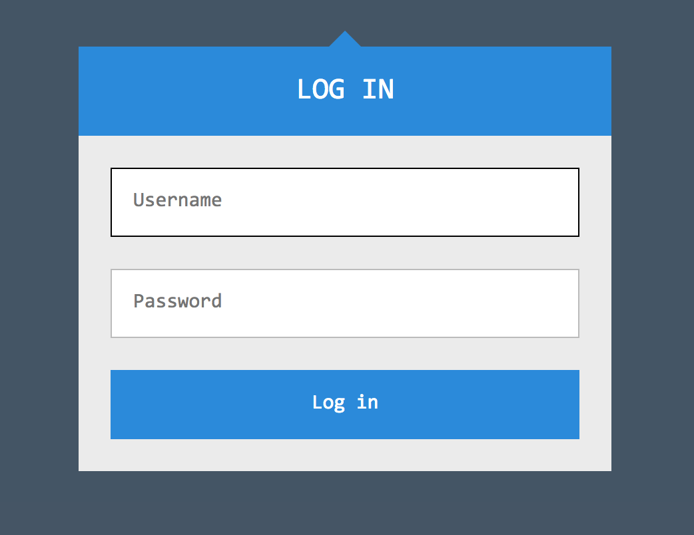

# LoginMe

http://202.120.7.194:8081

http://202.120.7.194:8082

http://202.120.7.194:8083



It's about inject to `new RegExp(#...#)` and `req.body[k]`


Since `password` column is generated by random string, and will re-random once server crash and restart. 
You have to extract the keys of object `this`.

```
username=bbbb
&|(if.*(").*\sreturn.*\s.*\s.*)|=$2;  this[Object.keys.call`${this}`[3]].charCodeAt`0` > 0x30 ? blah`` : 2 ; $2
```

Then blind the each character, if your condition is right, the server will throw an exception, then you got http error response 
(because of calling non-exists `blah` function)


