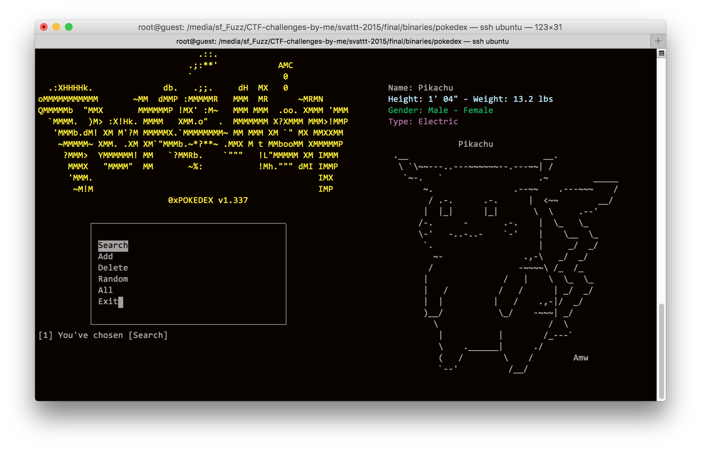

# pokedex

## Overview

This challenge is released on Nov.2015

## Bug

There is uninitliazed value, when `add` a pokémon.

https://github.com/l4wio/CTF-challenges-by-me/blob/master/svattt-2015/final/pokedex/server.c#L176-L177

So, to trigger and leverage the bug, we add a valid one first, when be asking:

https://github.com/l4wio/CTF-challenges-by-me/blob/master/svattt-2015/final/pokedex/server.c#L206

We say `Yes`, then on the second one, we make an invalid size to trigger.

From now on, we can easily overflow on `data` heap (because it's re-using buffer `data` of the previous pokémon - the first time we adding pokémon).

Then simply, overwrite the path of pokémon ascii to read the flag.

## Solution

https://github.com/l4wio/CTF-challenges-by-me/blob/master/svattt-2015/final/pokedex/solution.py
